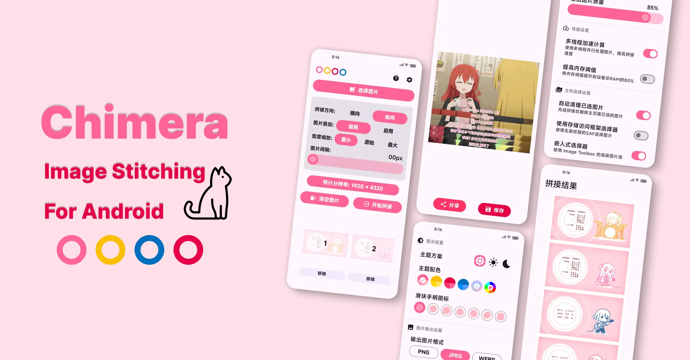
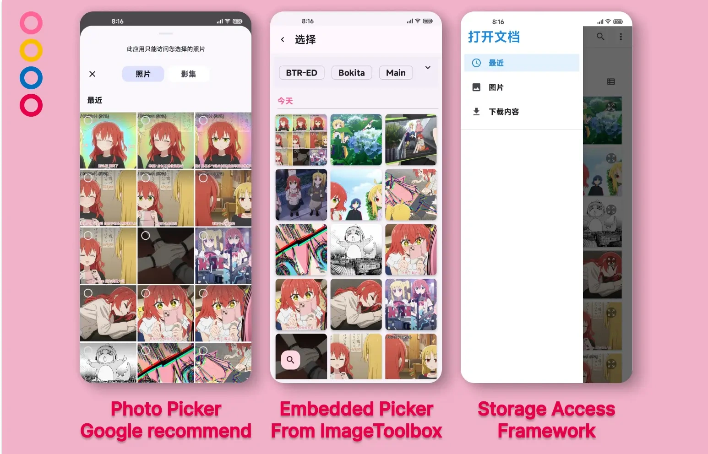

<div align="center">
</br>

</div>


<div align="center">

# Chimera
</div>

<p align="center">
  
  
  </br>
  
  
  </br>
  
  
  </br>
  <a href="https://deepwiki.com/ReRokutosei/Chimera"></a>
  </br>
  

<div align="center">

**English | [简体中文](README_CN.md)**

## 🗺️ Project Overview

Chimera is a modern Android **image stitching** application

Developed using **Kotlin** and **Jetpack Compose**

Allows stitching multiple images **into a long or wide image** in different modes

**Supports JPEG, PNG, WEBP**

Support: English, Spanish, Japanese, Simplified Chinese, Traditional Chinese (HK), Traditional Chinese (TW)

</div>

## 🌟 Core Features

### 🖼️ Multiple Image Selection Methods



The app supports multiple selectors and can be used even without granting any permissions:

1. Photo Picker
	  - **No permissions required**
	  - Compatible with SDK 31+ or devices that can receive Google component updates
	  - Google-recommended modern selection method
	  - However, when selecting multiple images, the URL order may be scrambled, and it can only view albums (photo pages) stored in the public Picture directory

2. Embedded Picker
	  - **Requires storage permission**: `READ_MEDIA_IMAGES` (SDK 33+) or `READ_EXTERNAL_STORAGE` (SDK 32-)
	  - Powerful selector extracted from the ImageToolbox project, supports search and album viewing
	  - Beautiful interface that solves Photo Picker issues

3. Storage Access Framework Selector (SAF)
	  - **No permissions required**
	  - Compatible with all SDK versions (29-36)
	  - Secure file access through system file picker


### 🔧 Stitching Modes

#### 📐 Direct Stitching
- **Horizontal stitching**: Arrange images from left to right horizontally
- **Vertical stitching**: Arrange images from top to bottom vertically
- **Image spacing**: Supports 0-50px image spacing settings, filled with black pixels
- **Width/Height scaling**:
  - Minimum: Scale all images to the minimum width/height
  - Original: Keep original image dimensions
  - Maximum: Scale all images to the maximum width/height
- **Image reordering**: After selecting images, you can long-press and drag selected images to change order

#### 🎯 Overlay Stitching
- **Image overlay stitching**: Display part of one image overlaid with the next image, can be used to create video subtitle screenshots
- **Overlay area ratio**: Adjustable overlay area ratio from 0-100%

### 🎨 Personalized Themes
- **🌙 Dark mode**: Supports manual switching and following system settings
- **🌈 Dynamic color theme**: Dynamic theme colors based on system wallpaper color (Android 12+ only)
  - Note: Requires using native Android wallpaper app, third-party wallpaper programs including some OEM manufacturers' cannot be recognized
- **🎀 Predefined color schemes**: Bocchi, Nijika, Ryo, Kita themes
- **🖌️ Custom colors**: Can create custom color schemes

### ⚙️ Settings Options
- **💾 Image output settings**: Supports PNG, JPEG and WEBP formats, adjustable output quality (PNG default lossless, not adjustable)
- **⚡ Multi-threaded acceleration**: When enabled, will use parallel acceleration process
- **🧠 Increase memory threshold**: Default memory threshold is 50% of device RAM, when enabled will increase to 80%

## 📲 Usage

1. 🚀 Open the Chimera app
2. 🖼️ Click the "Select Images" button to select images to stitch
3. ⚙️ Adjust stitching parameters (direction, scaling mode, spacing, etc.)
4. 🧱 Click the "Start Stitching" button
5. 👀 Preview the stitching result on the result page, can choose to save to album or share with other apps

## 🏗️ Technical Architecture

### 🏢 Architecture Pattern
- **MVVM architecture pattern**: Uses Model-View-ViewModel architecture to separate data logic and UI logic
- **Single Activity with multiple Compose interfaces**: The entire app is built on a single Activity and multiple Compose interfaces

### 💻 Technology Stack
- **Kotlin & Coroutines**
- **Jetpack Compose**
- **Android Architecture Components**

## ⚠️ Technical Limitations and Notes

### 📏 Image Format Limitations
Image stitching is limited by both file format technical specifications and device memory:

- JPEG: Technical maximum size is 65,535 × 65,535 pixels (16-bit limit), App defaults to JPEG format output
- WebP: Whether lossless or lossy, the maximum size is typically limited to around 16,384 × 16,384 pixels
- PNG: Technical maximum size up to 4,294,967,295 × 4,294,967,295 pixels (32-bit unsigned integer limit), theoretically the highest

### 💾 Memory Limitations
> [!IMPORTANT]
> Regardless of format, the biggest limitation in actual operation is **device memory (RAM) and Android VM mechanism** limitations.

The memory required for decoding large images (width × height × 4 bytes/pixel) can easily cause app crashes (OOM Crash).

If you have many or large images, it is recommended to **go to settings and adjust to PNG format and enable increased memory threshold**.

App supports processing over 100 images, but requires significant RAM. Due to Android VM limitations, we recommend using a desktop application for large batches.

### 🐞 Known Issues
Testing shows that PhotoPicker (`PickMultipleVisualMedia`) does not guarantee the order of returned URIs. When users select many images, the returned list order may be scrambled. This is a known platform issue that Google has not fixed.

Related issue discussion link: https://issuetracker.google.com/issues/264215151

For Embedded Picker and SAF selectors, image order is correct.

## 📦 Installation

You can obtain the app through the following methods:

1. 📥 Download the latest APK file from [GitHub Releases](https://github.com/ReRokutosei/Chimera/releases)
2. 🔧 Clone the source code and build the project yourself

## 🔨 Building the Project

<details>
<summary><strong>Click Here</strong></summary>

### 🛠️ Environment Requirements

- **Android Studio Narwhal | 2025.1.3** (or higher)

- **JDK 21** (recommended to use Android Studio's built-in JetBrains Runtime 21)

- **Android SDK** obtained through Android Studio


### 📋 Build Steps

#### 1. 📂 Shallow clone the project locally:
```bash
git clone --depth 1 https://github.com/ReRokutosei/Chimera.git
```

#### 2. 💼 Open the project in Android Studio

#### 3. 📁 Create `local.properties` in the root directory and write your SDK path
```
// For example
sdk.dir=D\:\\yourpath\\AndroidSdk
```

#### 4. 🔐 Generate signing key

Click the `Build` menu at the top of Android Studio

  -> `Generate Signed App Bundle or APK` 

  -> Follow instructions to generate key 

  -> Store key in `./keystore/Chimera.jks`

#### 5. ⚙️ Create `gradle.properties` in user home directory
- In your local development environment, create Gradle config file at:

- Windows: `C:\Users\{username}\.gradle\gradle.properties`

- macOS/Linux: `~/.gradle/gradle.properties`

- Add your signing configuration to this file:
```properties
KEYSTORE_PATH=../keystore/Chimera.jks
KEYSTORE_PASSWORD=yourpassword
KEY_ALIAS=chimera_release
KEY_PASSWORD=yourpassword
```

#### 6. 🔄 Click `Gradle Sync` in Android Studio

#### 7. 🏗️ Build the project:
```bash
./gradlew assembleRelease
```

</details>

## 🔐 Privacy Policy

This app does not request any network permissions, does not collect, store, process, or transmit any of your personal information. All operations are performed locally on your device.

See [Privacy Policy](PrivacyPolicy_EN.md) file for details.

## ⚠️ Disclaimer

The app is provided "as is" without any warranties. We are not responsible for any consequences arising from the use of this app.

See [Disclaimer](Disclaimer_EN.md) file for details.

## 📜 License

This project is licensed under the GNU General Public License v3.0. See [LICENSE](LICENSE) file for details.

## 🙏 Resource Information
### 🧰 ImageToolbox
This project uses **Embedded Picker, Fancy Slider, Image Reorder Carousel** components from [ImageToolbox (Apache License 2.0)](https://github.com/T8RIN/ImageToolbox), thanks to the original project contributors for their excellent work!

> See directory `./t8rin` for details

If you have more image processing needs, I highly recommend trying the powerful [**ImageToolbox**](https://github.com/T8RIN/ImageToolbox/releases/latest)

### 🎨 App Icon
App Icon Design by [Freepik](https://www.freepik.com/icon/animal_13228011)

### 🖼️ Demo Images
The background of the app Settings page, and README Screenshots are from the anime ["Bocchi the Rock!"](https://bocchi.rocks/), copyright belongs to "©HAMAJI AKI・Houbunsha/Bocchi the Rock! Production Committee"

## 📚 Dependencies

<details>
<summary><strong>Click Here to View</strong></summary>

- [AboutLibraries Core Library](https://github.com/mikepenz/AboutLibraries) 13.2.1 | Under Apache License 2.0
- [Accompanist Drawable Painter library](https://github.com/google/accompanist/) 0.32.0 | Under Apache License 2.0
- [Activity](https://developer.android.com/jetpack/androidx/releases/activity#1.12.3) 1.12.3 | Under Apache License 2.0
- [Activity Compose](https://developer.android.com/jetpack/androidx/releases/activity#1.12.3) 1.12.3 | Under Apache License 2.0
- [Activity Kotlin Extensions](https://developer.android.com/jetpack/androidx/releases/activity#1.12.3) 1.12.3 | Under Apache License 2.0
- [Android App Startup Runtime](https://developer.android.com/jetpack/androidx/releases/startup#1.1.1) 1.1.1 | Under Apache License 2.0
- [Android Arch-Common](https://developer.android.com/jetpack/androidx/releases/arch-core#2.2.0) 2.2.0 | Under Apache License 2.0
- [Android Arch-Runtime](https://developer.android.com/jetpack/androidx/releases/arch-core#2.2.0) 2.2.0 | Under Apache License 2.0
- [Android ConstraintLayout](http://tools.android.com) 2.1.0 | Under Apache License 2.0
- [Android ConstraintLayout Core](http://tools.android.com) 1.0.0 | Under Apache License 2.0
- [Android Graphics Path](https://developer.android.com/jetpack/androidx/releases/graphics#1.0.1) 1.0.1 | Under Apache License 2.0
- [Android Resource Inspection - Annotations](https://developer.android.com/jetpack/androidx/releases/resourceinspection#1.0.1) 1.0.1 | Under Apache License 2.0
- [Android Tracing](https://developer.android.com/jetpack/androidx/releases/tracing#1.2.0) 1.2.0 | Under Apache License 2.0
- [AndroidX Autofill](https://developer.android.com/jetpack/androidx) 1.0.0 | Under Apache License 2.0
- [AndroidX Futures](https://developer.android.com/topic/libraries/architecture/index.html) 1.1.0 | Under Apache License 2.0
- [AndroidX Widget ViewPager2](https://developer.android.com/jetpack/androidx) 1.0.0 | Under Apache License 2.0
- [androidx.core:core-viewtree](https://developer.android.com/jetpack/androidx/releases/core#1.0.0) 1.0.0 | Under Apache License 2.0
- [androidx.customview:poolingcontainer](https://developer.android.com/jetpack/androidx/releases/customview#1.0.0) 1.0.0 | Under Apache License 2.0
- [Annotation](https://developer.android.com/jetpack/androidx/releases/annotation#1.9.1) 1.9.1 | Under Apache License 2.0
- [Annotation](https://github.com/JetBrains/compose-jb) 1.9.3 | Under Apache License 2.0
- [AppCompat](https://developer.android.com/jetpack/androidx/releases/appcompat#1.7.1) 1.7.1 | Under Apache License 2.0
- [AppCompat Resources](https://developer.android.com/jetpack/androidx/releases/appcompat#1.7.1) 1.7.1 | Under Apache License 2.0
- [coil](https://github.com/coil-kt/coil) 2.7.0 | Under Apache License 2.0
- [coil-base](https://github.com/coil-kt/coil) 2.7.0 | Under Apache License 2.0
- [coil-compose](https://github.com/coil-kt/coil) 2.7.0 | Under Apache License 2.0
- [coil-compose-base](https://github.com/coil-kt/coil) 2.7.0 | Under Apache License 2.0
- [collections](https://developer.android.com/jetpack/androidx/releases/collection#1.5.0) 1.5.0 | Under Apache License 2.0
- [collections](https://github.com/JetBrains/compose-jb) 1.9.3 | Under Apache License 2.0
- [Collections Kotlin Extensions](https://developer.android.com/jetpack/androidx/releases/collection#1.5.0) 1.5.0 | Under Apache License 2.0
- [colorpicker-compose](https://github.com/skydoves/colorpicker-compose/) 1.1.3 | Under Apache License 2.0
- [Compose Animation](https://developer.android.com/jetpack/androidx/releases/compose-animation#1.10.2) 1.10.2 | Under Apache License 2.0
- [Compose Animation](https://github.com/JetBrains/compose-jb) 1.9.3 | Under Apache License 2.0
- [Compose Animation Core](https://developer.android.com/jetpack/androidx/releases/compose-animation#1.10.2) 1.10.2 | Under Apache License 2.0
- [Compose Animation Core](https://github.com/JetBrains/compose-jb) 1.9.3 | Under Apache License 2.0
- [Compose Foundation](https://developer.android.com/jetpack/androidx/releases/compose-foundation#1.10.2) 1.10.2 | Under Apache License 2.0
- [Compose Foundation](https://github.com/JetBrains/compose-jb) 1.9.3 | Under Apache License 2.0
- [Compose Geometry](https://developer.android.com/jetpack/androidx/releases/compose-ui#1.10.2) 1.10.2 | Under Apache License 2.0
- [Compose Geometry](https://github.com/JetBrains/compose-jb) 1.9.3 | Under Apache License 2.0
- [Compose Graphics](https://developer.android.com/jetpack/androidx/releases/compose-ui#1.10.2) 1.10.2 | Under Apache License 2.0
- [Compose Graphics](https://github.com/JetBrains/compose-jb) 1.9.3 | Under Apache License 2.0
- [Compose Layouts](https://developer.android.com/jetpack/androidx/releases/compose-foundation#1.10.2) 1.10.2 | Under Apache License 2.0
- [Compose Layouts](https://github.com/JetBrains/compose-jb) 1.9.3 | Under Apache License 2.0
- [Compose Material Components](https://developer.android.com/jetpack/androidx/releases/compose-material#1.10.2) 1.10.2 | Under Apache License 2.0
- [Compose Material Icons Core](https://developer.android.com/jetpack/androidx/releases/compose-material#1.7.8) 1.7.8 | Under Apache License 2.0
- [Compose Material Icons Extended](https://developer.android.com/jetpack/androidx/releases/compose-material#1.7.8) 1.7.8 | Under Apache License 2.0
- [Compose Material Ripple](https://developer.android.com/jetpack/androidx/releases/compose-material#1.10.2) 1.10.2 | Under Apache License 2.0
- [Compose Material3 Components](https://developer.android.com/jetpack/androidx/releases/compose-material3#1.5.0-alpha13) 1.5.0-alpha13 | Under Apache License 2.0
- [Compose Navigation](https://developer.android.com/jetpack/androidx/releases/navigation#2.9.7) 2.9.7 | Under Apache License 2.0
- [Compose Runtime](https://developer.android.com/jetpack/androidx/releases/compose-runtime#1.10.2) 1.10.2 | Under Apache License 2.0
- [Compose Runtime](https://github.com/JetBrains/compose-jb) 1.9.3 | Under Apache License 2.0
- [Compose Runtime Annotation](https://developer.android.com/jetpack/androidx/releases/compose-runtime#1.10.2) 1.10.2 | Under Apache License 2.0
- [Compose Runtime Retain](https://developer.android.com/jetpack/androidx/releases/compose-runtime#1.10.2) 1.10.2 | Under Apache License 2.0
- [Compose Saveable](https://developer.android.com/jetpack/androidx/releases/compose-runtime#1.10.2) 1.10.2 | Under Apache License 2.0
- [Compose Saveable](https://github.com/JetBrains/compose-jb) 1.9.3 | Under Apache License 2.0
- [Compose Testing manifest dependency](https://developer.android.com/jetpack/androidx/releases/compose-ui#1.10.2) 1.10.2 | Under Apache License 2.0
- [Compose Tooling](https://developer.android.com/jetpack/androidx/releases/compose-ui#1.10.2) 1.10.2 | Under Apache License 2.0
- [Compose Tooling Data](https://developer.android.com/jetpack/androidx/releases/compose-ui#1.10.2) 1.10.2 | Under Apache License 2.0
- [Compose UI](https://developer.android.com/jetpack/androidx/releases/compose-ui#1.10.2) 1.10.2 | Under Apache License 2.0
- [Compose UI Preview Tooling](https://developer.android.com/jetpack/androidx/releases/compose-ui#1.10.2) 1.10.2 | Under Apache License 2.0
- [Compose UI primitives](https://github.com/JetBrains/compose-jb) 1.9.3 | Under Apache License 2.0
- [Compose UI Text](https://developer.android.com/jetpack/androidx/releases/compose-ui#1.10.2) 1.10.2 | Under Apache License 2.0
- [Compose UI Text](https://github.com/JetBrains/compose-jb) 1.9.3 | Under Apache License 2.0
- [Compose Unit](https://developer.android.com/jetpack/androidx/releases/compose-ui#1.10.2) 1.10.2 | Under Apache License 2.0
- [Compose Unit](https://github.com/JetBrains/compose-jb) 1.9.3 | Under Apache License 2.0
- [Compose Util](https://developer.android.com/jetpack/androidx/releases/compose-ui#1.10.2) 1.10.2 | Under Apache License 2.0
- [Compose Util](https://github.com/JetBrains/compose-jb) 1.9.3 | Under Apache License 2.0
- [Core](https://developer.android.com/jetpack/androidx/releases/core#1.17.0) 1.17.0 | Under Apache License 2.0
- [Core Kotlin Extensions](https://developer.android.com/jetpack/androidx/releases/core#1.17.0) 1.17.0 | Under Apache License 2.0
- [DataStore](https://developer.android.com/jetpack/androidx/releases/datastore#1.2.0) 1.2.0 | Under Apache License 2.0
- [DataStore Core](https://developer.android.com/jetpack/androidx/releases/datastore#1.2.0) 1.2.0 | Under Apache License 2.0
- [DataStore Core Okio](https://developer.android.com/jetpack/androidx/releases/datastore#1.2.0) 1.2.0 | Under Apache License 2.0
- [DynamicAnimation](https://developer.android.com/jetpack/androidx/releases/dynamicanimation#1.1.0) 1.1.0 | Under Apache License 2.0
- [Emoji2](https://developer.android.com/jetpack/androidx/releases/emoji2#1.4.0) 1.4.0 | Under Apache License 2.0
- [Emoji2 Views Helper](https://developer.android.com/jetpack/androidx/releases/emoji2#1.4.0) 1.4.0 | Under Apache License 2.0
- [error-prone annotations](https://errorprone.info/error_prone_annotations) 2.15.0 | Under Apache License 2.0
- [Experimental annotation](https://developer.android.com/jetpack/androidx/releases/annotation#1.4.1) 1.4.1 | Under Apache License 2.0
- [Graphics Shapes](https://developer.android.com/jetpack/androidx/releases/graphics#1.0.1) 1.0.1 | Under Apache License 2.0
- [Guava ListenableFuture only](https://github.com/google/guava/listenablefuture) 1.0 | Under Apache License 2.0
- [JetBrains Java Annotations](https://github.com/JetBrains/java-annotations) 23.0.0 | Under Apache License 2.0
- [Jetpack Compose Libraries BOM](https://developer.android.com/jetpack) 2026.01.01 | Under Apache License 2.0
- [JSpecify annotations](http://jspecify.org/) 1.0.0 | Under Apache License 2.0
- [Kotlin Libraries bill-of-materials](https://kotlinlang.org/) 1.8.22 | Under Apache License 2.0
- [Kotlin Stdlib](https://kotlinlang.org/) 2.3.10 | Under Apache License 2.0
- [Kotlin Stdlib Common](https://kotlinlang.org/) 2.3.10 | Under Apache License 2.0
- [Kotlin Stdlib Jdk7](https://kotlinlang.org/) 1.8.21 | Under Apache License 2.0
- [Kotlin Stdlib Jdk8](https://kotlinlang.org/) 1.8.21 | Under Apache License 2.0
- [kotlinx-collections-immutable](https://github.com/Kotlin/kotlinx.collections.immutable) 0.4.0 | Under Apache License 2.0
- [kotlinx-coroutines-android](https://github.com/Kotlin/kotlinx.coroutines) 1.9.0 | Under Apache License 2.0
- [kotlinx-coroutines-bom](https://github.com/Kotlin/kotlinx.coroutines) 1.9.0 | Under Apache License 2.0
- [kotlinx-coroutines-core](https://github.com/Kotlin/kotlinx.coroutines) 1.9.0 | Under Apache License 2.0
- [kotlinx-serialization-bom](https://github.com/Kotlin/kotlinx.serialization) 1.10.0 | Under Apache License 2.0
- [kotlinx-serialization-core](https://github.com/Kotlin/kotlinx.serialization) 1.10.0 | Under Apache License 2.0
- [kotlinx-serialization-json](https://github.com/Kotlin/kotlinx.serialization) 1.10.0 | Under Apache License 2.0
- [Lifecycle Kotlin Extensions](https://developer.android.com/jetpack/androidx/releases/lifecycle#2.10.0) 2.10.0 | Under Apache License 2.0
- [Lifecycle LiveData](https://developer.android.com/jetpack/androidx/releases/lifecycle#2.10.0) 2.10.0 | Under Apache License 2.0
- [Lifecycle LiveData Core](https://developer.android.com/jetpack/androidx/releases/lifecycle#2.10.0) 2.10.0 | Under Apache License 2.0
- [Lifecycle Process](https://developer.android.com/jetpack/androidx/releases/lifecycle#2.10.0) 2.10.0 | Under Apache License 2.0
- [Lifecycle Runtime](https://developer.android.com/jetpack/androidx/releases/lifecycle#2.10.0) 2.10.0 | Under Apache License 2.0
- [Lifecycle Runtime](https://github.com/JetBrains/compose-jb) 2.9.6 | Under Apache License 2.0
- [Lifecycle Runtime Compose](https://developer.android.com/jetpack/androidx/releases/lifecycle#2.10.0) 2.10.0 | Under Apache License 2.0
- [Lifecycle Runtime Compose](https://github.com/JetBrains/compose-jb) 2.9.6 | Under Apache License 2.0
- [Lifecycle ViewModel](https://developer.android.com/jetpack/androidx/releases/lifecycle#2.10.0) 2.10.0 | Under Apache License 2.0
- [Lifecycle ViewModel](https://github.com/JetBrains/compose-jb) 2.9.6 | Under Apache License 2.0
- [Lifecycle ViewModel Compose](https://developer.android.com/jetpack/androidx/releases/lifecycle#2.10.0) 2.10.0 | Under Apache License 2.0
- [Lifecycle ViewModel Kotlin Extensions](https://developer.android.com/jetpack/androidx/releases/lifecycle#2.10.0) 2.10.0 | Under Apache License 2.0
- [Lifecycle ViewModel with SavedState](https://developer.android.com/jetpack/androidx/releases/lifecycle#2.10.0) 2.10.0 | Under Apache License 2.0
- [Lifecycle ViewModel with SavedState](https://github.com/JetBrains/compose-jb) 2.9.6 | Under Apache License 2.0
- [Lifecycle-Common](https://developer.android.com/jetpack/androidx/releases/lifecycle#2.10.0) 2.10.0 | Under Apache License 2.0
- [Lifecycle-Common](https://github.com/JetBrains/compose-jb) 2.9.6 | Under Apache License 2.0
- [Lifecycle-Common for Java 8](https://developer.android.com/jetpack/androidx/releases/lifecycle#2.10.0) 2.10.0 | Under Apache License 2.0
- [LiveData Core Kotlin Extensions](https://developer.android.com/jetpack/androidx/releases/lifecycle#2.10.0) 2.10.0 | Under Apache License 2.0
- [Material Components for Android](https://github.com/material-components/material-components-android) 1.13.0 | Under Apache License 2.0
- [Navigation Common](https://developer.android.com/jetpack/androidx/releases/navigation#2.9.7) 2.9.7 | Under Apache License 2.0
- [Navigation Event](https://developer.android.com/jetpack/androidx/releases/navigationevent#1.0.2) 1.0.2 | Under Apache License 2.0
- [Navigation Runtime](https://developer.android.com/jetpack/androidx/releases/navigation#2.9.7) 2.9.7 | Under Apache License 2.0
- [NavigationEvent Compose](https://developer.android.com/jetpack/androidx/releases/navigationevent#1.0.2) 1.0.2 | Under Apache License 2.0
- [okhttp](https://square.github.io/okhttp/) 4.12.0 | Under Apache License 2.0
- [okio](https://github.com/square/okio/) 3.9.1 | Under Apache License 2.0
- [Parcelize Runtime](https://kotlinlang.org/) 2.3.10 | Under Apache License 2.0
- [Preferences DataStore](https://developer.android.com/jetpack/androidx/releases/datastore#1.2.0) 1.2.0 | Under Apache License 2.0
- [Preferences DataStore Core](https://developer.android.com/jetpack/androidx/releases/datastore#1.2.0) 1.2.0 | Under Apache License 2.0
- [Preferences DataStore Proto](https://developer.android.com/jetpack/androidx/releases/datastore#1.2.0) 1.2.0 | Under Apache License 2.0
- [Preferences External Protobuf](https://developer.android.com/jetpack/androidx/releases/datastore#1.2.0) 1.2.0 | Under BSD 3-Clause "New" or "Revised" License
- [Profile Installer](https://developer.android.com/jetpack/androidx/releases/profileinstaller#1.4.0) 1.4.0 | Under Apache License 2.0
- [Reorderable](https://github.com/Calvin-LL/Reorderable) 3.0.0 | Under Apache License 2.0
- [Saved State](https://developer.android.com/jetpack/androidx/releases/savedstate#1.4.0) 1.4.0 | Under Apache License 2.0
- [Saved State](https://github.com/JetBrains/compose-jb) 1.3.6 | Under Apache License 2.0
- [Saved State Compose](https://developer.android.com/jetpack/androidx/releases/savedstate#1.4.0) 1.4.0 | Under Apache License 2.0
- [Saved State Compose](https://github.com/JetBrains/compose-jb) 1.3.6 | Under Apache License 2.0
- [SavedState Kotlin Extensions](https://developer.android.com/jetpack/androidx/releases/savedstate#1.4.0) 1.4.0 | Under Apache License 2.0
- [SubsamplingScaleImageView](https://github.com/davemorrissey/subsampling-scale-image-view) 3.10.0 | Under Apache License 2.0
- [Support AnimatedVectorDrawable](https://developer.android.com/jetpack/androidx) 1.1.0 | Under Apache License 2.0
- [Support CardView v7](http://developer.android.com/tools/extras/support-library.html) 1.0.0 | Under Apache License 2.0
- [Support Coordinator Layout](https://developer.android.com/jetpack/androidx) 1.1.0 | Under Apache License 2.0
- [Support Cursor Adapter](http://developer.android.com/tools/extras/support-library.html) 1.0.0 | Under Apache License 2.0
- [Support Custom View](https://developer.android.com/jetpack/androidx) 1.1.0 | Under Apache License 2.0
- [Support Drawer Layout](https://developer.android.com/jetpack/androidx) 1.1.1 | Under Apache License 2.0
- [Support ExifInterface](https://developer.android.com/jetpack/androidx) 1.1.0 | Under Apache License 2.0
- [Support fragment](https://developer.android.com/jetpack/androidx/releases/fragment#1.5.4) 1.5.4 | Under Apache License 2.0
- [Support Interpolators](http://developer.android.com/tools/extras/support-library.html) 1.0.0 | Under Apache License 2.0
- [Support loader](http://developer.android.com/tools/extras/support-library.html) 1.0.0 | Under Apache License 2.0
- [Support RecyclerView](https://developer.android.com/jetpack/androidx/releases/recyclerview#1.2.1) 1.2.1 | Under Apache License 2.0
- [Support VectorDrawable](https://developer.android.com/jetpack/androidx) 1.1.0 | Under Apache License 2.0
- [Support View Pager](http://developer.android.com/tools/extras/support-library.html) 1.0.0 | Under Apache License 2.0
- [Transition](https://developer.android.com/jetpack/androidx/releases/transition#1.5.0) 1.5.0 | Under Apache License 2.0
- [VersionedParcelable](http://developer.android.com/tools/extras/support-library.html) 1.1.1 | Under Apache License 2.0
- [WindowManager](https://developer.android.com/jetpack/androidx/releases/window#1.5.0) 1.5.0 | Under Apache License 2.0
- [WindowManager Core](https://developer.android.com/jetpack/androidx/releases/window#1.5.0) 1.5.0 | Under Apache License 2.0

</details>