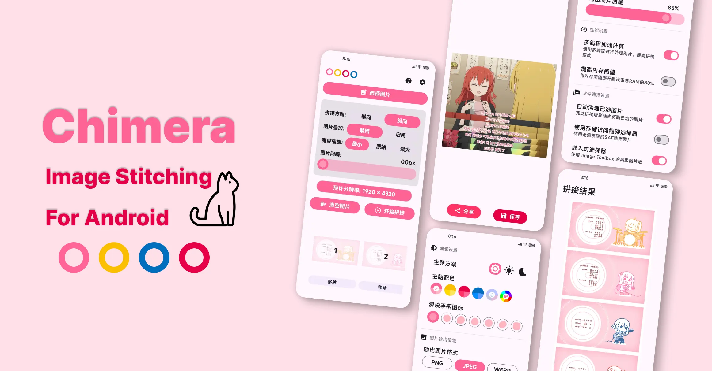
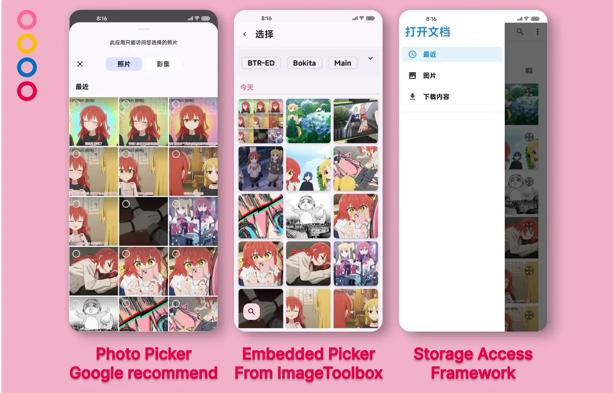

<div align="center">
</br>

</div>

<div align="center">

# Chimera
</div>

<p align="center">
  
  
  </br>
  
  
  </br>
  
  
  </br>
  <a href="https://deepwiki.com/ReRokutosei/Chimera"></a>
  </br>
  

<div align="center">

**English | [简体中文](README_CN.md)**

## 🗺️ Project Overview

Chimera is a modern Android image stitching utility built with **Kotlin** and **Jetpack Compose**. It provides multiple synthesis modes to create seamless vertical or horizontal composites.

Supporting JPEG, PNG, and WEBP, Chimera features a **fully offline design**, enabling complex processing without any network permissions. The app is deeply integrated with the Material You dynamic color system for a native, fluid experience.

</div>

## 🌟 Core Features

### Image Selection Methods



The app offers three selection strategies to balance privacy and advanced functionality:

- **System Photo Picker**: The recommended modern choice. Requires zero permissions (Android 13+ / SDK 31+).
- **Embedded Picker**: An advanced selector ported from the ImageToolbox project. It supports metadata search and album categorization while mitigating platform-specific URI ordering bugs found in the system picker.
- **Storage Access Framework (SAF)**: Secure image access through system-level file management, compatible with SDK 29-36.

### Synthesis Modes

- **Direct Stitching**:
  - Horizontal (left-to-right) or Vertical (top-to-bottom) layouts.
  - Adjustable image spacing (0-50px).
  - Three scaling strategies: Fit to Smallest, Preserve Original, or Fit to Largest.
  - Long-press and drag to reorder selected images.
- **Overlay Compositing**:
  - Create overlaps between images, ideal for video subtitle screenshots.
  - Precision control over the overlapping area ratio (0-100%).

### Personalization & Performance

- **Theming**: Dark Mode support and Material You dynamic coloring based on system wallpaper.
  - *Note: If using auto-rotating wallpaper services (e.g., Mi Carousel), the dynamic color system will capture the static wallpaper set by the OS rather than the rotating service's image. This is a system limitation, not a bug.*
- **Performance**: Optional multi-threaded acceleration via Kotlin Coroutines and manual memory allocation threshold overrides.
- **Output Control**: Export to JPEG, PNG, or WEBP with granular quality settings.

## ⚠️ Technical Limitations

<details>
<summary><strong>Expand for Memory & Format Details</strong></summary>

### Format Specifications
Stitching scale is governed by file format limits:
- **JPEG**: Hard limit of 65,535 × 65,535 pixels.
- **WebP**: Typical limit around 16,384 × 16,384 pixels.
- **PNG**: Theoretically massive (32-bit unsigned integer limit), best for extreme composites.

### Memory Constraints (OOM)
Due to Android VM architecture, processing large bitmaps (Width × Height × 4 bytes/pixel) is RAM-intensive. If the app crashes during heavy tasks:
1. Enable "Increase Memory Threshold" in Settings.
2. Switch output format to PNG.
3. For ultra-large datasets, a desktop-based utility is recommended.

### Known Issues
- **Photo Picker Ordering**: Due to an unpatched [Android platform bug](https://issuetracker.google.com/issues/264215151), the system Photo Picker may return URIs in an arbitrary order. Use "Embedded Picker" or "SAF" if selection order is critical.
</details>

## 🔨 Building the Project

<details>
<summary><strong>Expand for Dev Environment & Build Steps</strong></summary>

### Prerequisites
- **Android Studio Panda 2 | 2025.3.2** or newer.
- **JDK 21**.
- **Android SDK**.

### Build Guide
1. **Clone**: `git clone --depth 1 https://github.com/ReRokutosei/Chimera.git`
2. **SDK Setup**: Define `sdk.dir` in your root `local.properties`.
3. **Signing**: Add the following to your user-level `gradle.properties` (Windows: `%USERPROFILE%\.gradle\gradle.properties`):
   ```properties
   KEYSTORE_PATH=../keystore/Chimera.jks
   KEYSTORE_PASSWORD=yourpassword
   KEY_ALIAS=chimera_release
   KEY_PASSWORD=yourpassword
   ```
4. **Build**: Execute `./gradlew assembleRelease`.
</details>

## 🔐 Legal & Privacy

- **Privacy Policy**: No network permissions requested; zero data collection. All processing remains local. See [Privacy Policy](PrivacyPolicy_EN.md).
- **Disclaimer**: Provided "as is" without warranty. See [Disclaimer](Disclaimer_EN.md).
- **License**: Licensed under the GNU General Public License v3.0 (GPLv3). See [LICENSE](LICENSE).

## 🙏 Credits & Acknowledgments

- **ImageToolbox**: Special thanks to the [ImageToolbox](https://github.com/T8RIN/ImageToolbox) project for the Embedded Picker, Fancy Slider, and Image Reorder Carousel components.
- **Icon Design**: App icon designed by [Freepik](https://www.freepik.com/icon/animal_13228011).
- **Copyright Notice**: Background assets and screenshots are sourced from the anime **"Bocchi the Rock!"**. All rights reserved to:
  > ©HAMAJI AKI・Houbunsha/Bocchi the Rock! Production Committee

## 📚 Dependencies

<details>
<summary><strong>Click Here to View</strong></summary>

- [AboutLibraries Core Library](https://github.com/mikepenz/AboutLibraries) 13.2.1 | Under Apache License 2.0
- [Accompanist Drawable Painter library](https://github.com/google/accompanist/) 0.32.0 | Under Apache License 2.0
- [Activity](https://developer.android.com/jetpack/androidx/releases/activity#1.13.0) 1.13.0 | Under Apache License 2.0
- [Activity Compose](https://developer.android.com/jetpack/androidx/releases/activity#1.13.0) 1.13.0 | Under Apache License 2.0
- [Activity Kotlin Extensions](https://developer.android.com/jetpack/androidx/releases/activity#1.13.0) 1.13.0 | Under Apache License 2.0
- [Android App Startup Runtime](https://developer.android.com/jetpack/androidx/releases/startup#1.1.1) 1.1.1 | Under Apache License 2.0
- [Android Arch-Common](https://developer.android.com/jetpack/androidx/releases/arch-core#2.2.0) 2.2.0 | Under Apache License 2.0
- [Android Arch-Runtime](https://developer.android.com/jetpack/androidx/releases/arch-core#2.2.0) 2.2.0 | Under Apache License 2.0
- [Android ConstraintLayout](http://tools.android.com) 2.1.0 | Under Apache License 2.0
- [Android ConstraintLayout Core](http://tools.android.com) 1.0.0 | Under Apache License 2.0
- [Android Graphics Path](https://developer.android.com/jetpack/androidx/releases/graphics#1.0.1) 1.0.1 | Under Apache License 2.0
- [Android Resource Inspection - Annotations](https://developer.android.com/jetpack/androidx/releases/resourceinspection#1.0.1) 1.0.1 | Under Apache License 2.0
- [Android Tracing](https://developer.android.com/jetpack/androidx/releases/tracing#1.2.0) 1.2.0 | Under Apache License 2.0
- [AndroidX Autofill](https://developer.android.com/jetpack/androidx) 1.0.0 | Under Apache License 2.0
- [AndroidX Futures](https://developer.android.com/topic/libraries/architecture/index.html) 1.1.0 | Under Apache License 2.0
- [AndroidX Widget ViewPager2](https://developer.android.com/jetpack/androidx) 1.0.0 | Under Apache License 2.0
- [androidx.core:core-viewtree](https://developer.android.com/jetpack/androidx/releases/core#1.0.0) 1.0.0 | Under Apache License 2.0
- [androidx.customview:poolingcontainer](https://developer.android.com/jetpack/androidx/releases/customview#1.0.0) 1.0.0 | Under Apache License 2.0
- [Annotation](https://developer.android.com/jetpack/androidx/releases/annotation#1.9.1) 1.9.1 | Under Apache License 2.0
- [Annotation](https://github.com/JetBrains/compose-jb) 1.9.3 | Under Apache License 2.0
- [AppCompat](https://developer.android.com/jetpack/androidx/releases/appcompat#1.7.1) 1.7.1 | Under Apache License 2.0
- [AppCompat Resources](https://developer.android.com/jetpack/androidx/releases/appcompat#1.7.1) 1.7.1 | Under Apache License 2.0
- [coil](https://github.com/coil-kt/coil) 2.7.0 | Under Apache License 2.0
- [coil-base](https://github.com/coil-kt/coil) 2.7.0 | Under Apache License 2.0
- [coil-compose](https://github.com/coil-kt/coil) 2.7.0 | Under Apache License 2.0
- [coil-compose-base](https://github.com/coil-kt/coil) 2.7.0 | Under Apache License 2.0
- [collections](https://developer.android.com/jetpack/androidx/releases/collection#1.5.0) 1.5.0 | Under Apache License 2.0
- [collections](https://github.com/JetBrains/compose-jb) 1.9.3 | Under Apache License 2.0
- [Collections Kotlin Extensions](https://developer.android.com/jetpack/androidx/releases/collection#1.5.0) 1.5.0 | Under Apache License 2.0
- [colorpicker-compose](https://github.com/skydoves/colorpicker-compose/) 1.1.3 | Under Apache License 2.0
- [Compose Animation](https://developer.android.com/jetpack/androidx/releases/compose-animation#1.11.0-alpha06) 1.11.0-alpha06 | Under Apache License 2.0
- [Compose Animation](https://github.com/JetBrains/compose-jb) 1.9.3 | Under Apache License 2.0
- [Compose Animation Core](https://developer.android.com/jetpack/androidx/releases/compose-animation#1.11.0-alpha06) 1.11.0-alpha06 | Under Apache License 2.0
- [Compose Animation Core](https://github.com/JetBrains/compose-jb) 1.9.3 | Under Apache License 2.0
- [Compose Foundation](https://developer.android.com/jetpack/androidx/releases/compose-foundation#1.11.0-alpha06) 1.11.0-alpha06 | Under Apache License 2.0
- [Compose Foundation](https://github.com/JetBrains/compose-jb) 1.9.3 | Under Apache License 2.0
- [Compose Geometry](https://developer.android.com/jetpack/androidx/releases/compose-ui#1.11.0-alpha06) 1.11.0-alpha06 | Under Apache License 2.0
- [Compose Geometry](https://github.com/JetBrains/compose-jb) 1.9.3 | Under Apache License 2.0
- [Compose Graphics](https://developer.android.com/jetpack/androidx/releases/compose-ui#1.11.0-alpha06) 1.11.0-alpha06 | Under Apache License 2.0
- [Compose Graphics](https://github.com/JetBrains/compose-jb) 1.9.3 | Under Apache License 2.0
- [Compose Layouts](https://developer.android.com/jetpack/androidx/releases/compose-foundation#1.11.0-alpha06) 1.11.0-alpha06 | Under Apache License 2.0
- [Compose Layouts](https://github.com/JetBrains/compose-jb) 1.9.3 | Under Apache License 2.0
- [Compose Material Icons Core](https://developer.android.com/jetpack/androidx/releases/compose-material#1.7.8) 1.7.8 | Under Apache License 2.0
- [Compose Material Icons Extended](https://developer.android.com/jetpack/androidx/releases/compose-material#1.7.8) 1.7.8 | Under Apache License 2.0
- [Compose Material Ripple](https://developer.android.com/jetpack/androidx/releases/compose-material#1.10.5) 1.10.5 | Under Apache License 2.0
- [Compose Material3 Components](https://developer.android.com/jetpack/androidx/releases/compose-material3#1.5.0-alpha15) 1.5.0-alpha15 | Under Apache License 2.0
- [Compose Navigation](https://developer.android.com/jetpack/androidx/releases/navigation#2.9.7) 2.9.7 | Under Apache License 2.0
- [Compose Runtime](https://developer.android.com/jetpack/androidx/releases/compose-runtime#1.11.0-alpha06) 1.11.0-alpha06 | Under Apache License 2.0
- [Compose Runtime](https://github.com/JetBrains/compose-jb) 1.9.3 | Under Apache License 2.0
- [Compose Runtime Annotation](https://developer.android.com/jetpack/androidx/releases/compose-runtime#1.11.0-alpha06) 1.11.0-alpha06 | Under Apache License 2.0
- [Compose Runtime Retain](https://developer.android.com/jetpack/androidx/releases/compose-runtime#1.11.0-alpha06) 1.11.0-alpha06 | Under Apache License 2.0
- [Compose Saveable](https://developer.android.com/jetpack/androidx/releases/compose-runtime#1.11.0-alpha06) 1.11.0-alpha06 | Under Apache License 2.0
- [Compose Saveable](https://github.com/JetBrains/compose-jb) 1.9.3 | Under Apache License 2.0
- [Compose Testing manifest dependency](https://developer.android.com/jetpack/androidx/releases/compose-ui#1.11.0-alpha06) 1.11.0-alpha06 | Under Apache License 2.0
- [Compose Tooling](https://developer.android.com/jetpack/androidx/releases/compose-ui#1.11.0-alpha06) 1.11.0-alpha06 | Under Apache License 2.0
- [Compose Tooling Data](https://developer.android.com/jetpack/androidx/releases/compose-ui#1.11.0-alpha06) 1.11.0-alpha06 | Under Apache License 2.0
- [Compose UI](https://developer.android.com/jetpack/androidx/releases/compose-ui#1.11.0-alpha06) 1.11.0-alpha06 | Under Apache License 2.0
- [Compose UI Preview Tooling](https://developer.android.com/jetpack/androidx/releases/compose-ui#1.11.0-alpha06) 1.11.0-alpha06 | Under Apache License 2.0
- [Compose UI primitives](https://github.com/JetBrains/compose-jb) 1.9.3 | Under Apache License 2.0
- [Compose UI Text](https://developer.android.com/jetpack/androidx/releases/compose-ui#1.11.0-alpha06) 1.11.0-alpha06 | Under Apache License 2.0
- [Compose UI Text](https://github.com/JetBrains/compose-jb) 1.9.3 | Under Apache License 2.0
- [Compose Unit](https://developer.android.com/jetpack/androidx/releases/compose-ui#1.11.0-alpha06) 1.11.0-alpha06 | Under Apache License 2.0
- [Compose Unit](https://github.com/JetBrains/compose-jb) 1.9.3 | Under Apache License 2.0
- [Compose Util](https://developer.android.com/jetpack/androidx/releases/compose-ui#1.11.0-alpha06) 1.11.0-alpha06 | Under Apache License 2.0
- [Compose Util](https://github.com/JetBrains/compose-jb) 1.9.3 | Under Apache License 2.0
- [Core](https://developer.android.com/jetpack/androidx/releases/core#1.18.0) 1.18.0 | Under Apache License 2.0
- [Core Kotlin Extensions](https://developer.android.com/jetpack/androidx/releases/core#1.18.0) 1.18.0 | Under Apache License 2.0
- [DataStore](https://developer.android.com/jetpack/androidx/releases/datastore#1.2.1) 1.2.1 | Under Apache License 2.0
- [DataStore Core](https://developer.android.com/jetpack/androidx/releases/datastore#1.2.1) 1.2.1 | Under Apache License 2.0
- [DataStore Core Okio](https://developer.android.com/jetpack/androidx/releases/datastore#1.2.1) 1.2.1 | Under Apache License 2.0
- [DynamicAnimation](https://developer.android.com/jetpack/androidx/releases/dynamicanimation#1.1.0) 1.1.0 | Under Apache License 2.0
- [Emoji2](https://developer.android.com/jetpack/androidx/releases/emoji2#1.4.0) 1.4.0 | Under Apache License 2.0
- [Emoji2 Views Helper](https://developer.android.com/jetpack/androidx/releases/emoji2#1.4.0) 1.4.0 | Under Apache License 2.0
- [error-prone annotations](https://errorprone.info/error_prone_annotations) 2.15.0 | Under Apache License 2.0
- [Experimental annotation](https://developer.android.com/jetpack/androidx/releases/annotation#1.4.1) 1.4.1 | Under Apache License 2.0
- [Graphics Shapes](https://developer.android.com/jetpack/androidx/releases/graphics#1.0.1) 1.0.1 | Under Apache License 2.0
- [Guava ListenableFuture only](https://github.com/google/guava/listenablefuture) 1.0 | Under Apache License 2.0
- [JetBrains Java Annotations](https://github.com/JetBrains/java-annotations) 23.0.0 | Under Apache License 2.0
- [Jetpack Compose Libraries BOM](https://developer.android.com/jetpack) 2026.03.00 | Under Apache License 2.0
- [JSpecify annotations](http://jspecify.org/) 1.0.0 | Under Apache License 2.0
- [Kotlin Libraries bill-of-materials](https://kotlinlang.org/) 1.8.22 | Under Apache License 2.0
- [Kotlin Stdlib](https://kotlinlang.org/) 2.3.20 | Under Apache License 2.0
- [Kotlin Stdlib Common](https://kotlinlang.org/) 2.3.20 | Under Apache License 2.0
- [Kotlin Stdlib Jdk7](https://kotlinlang.org/) 1.8.21 | Under Apache License 2.0
- [Kotlin Stdlib Jdk8](https://kotlinlang.org/) 1.8.21 | Under Apache License 2.0
- [kotlinx-collections-immutable](https://github.com/Kotlin/kotlinx.collections.immutable) 0.4.0 | Under Apache License 2.0
- [kotlinx-coroutines-android](https://github.com/Kotlin/kotlinx.coroutines) 1.9.0 | Under Apache License 2.0
- [kotlinx-coroutines-bom](https://github.com/Kotlin/kotlinx.coroutines) 1.9.0 | Under Apache License 2.0
- [kotlinx-coroutines-core](https://github.com/Kotlin/kotlinx.coroutines) 1.9.0 | Under Apache License 2.0
- [kotlinx-serialization-bom](https://github.com/Kotlin/kotlinx.serialization) 1.10.0 | Under Apache License 2.0
- [kotlinx-serialization-core](https://github.com/Kotlin/kotlinx.serialization) 1.10.0 | Under Apache License 2.0
- [kotlinx-serialization-json](https://github.com/Kotlin/kotlinx.serialization) 1.10.0 | Under Apache License 2.0
- [Lifecycle Kotlin Extensions](https://developer.android.com/jetpack/androidx/releases/lifecycle#2.10.0) 2.10.0 | Under Apache License 2.0
- [Lifecycle LiveData](https://developer.android.com/jetpack/androidx/releases/lifecycle#2.10.0) 2.10.0 | Under Apache License 2.0
- [Lifecycle LiveData Core](https://developer.android.com/jetpack/androidx/releases/lifecycle#2.10.0) 2.10.0 | Under Apache License 2.0
- [Lifecycle Process](https://developer.android.com/jetpack/androidx/releases/lifecycle#2.10.0) 2.10.0 | Under Apache License 2.0
- [Lifecycle Runtime](https://developer.android.com/jetpack/androidx/releases/lifecycle#2.10.0) 2.10.0 | Under Apache License 2.0
- [Lifecycle Runtime](https://github.com/JetBrains/compose-jb) 2.9.6 | Under Apache License 2.0
- [Lifecycle Runtime Compose](https://developer.android.com/jetpack/androidx/releases/lifecycle#2.10.0) 2.10.0 | Under Apache License 2.0
- [Lifecycle Runtime Compose](https://github.com/JetBrains/compose-jb) 2.9.6 | Under Apache License 2.0
- [Lifecycle ViewModel](https://developer.android.com/jetpack/androidx/releases/lifecycle#2.10.0) 2.10.0 | Under Apache License 2.0
- [Lifecycle ViewModel](https://github.com/JetBrains/compose-jb) 2.9.6 | Under Apache License 2.0
- [Lifecycle ViewModel Compose](https://developer.android.com/jetpack/androidx/releases/lifecycle#2.10.0) 2.10.0 | Under Apache License 2.0
- [Lifecycle ViewModel Kotlin Extensions](https://developer.android.com/jetpack/androidx/releases/lifecycle#2.10.0) 2.10.0 | Under Apache License 2.0
- [Lifecycle ViewModel with SavedState](https://developer.android.com/jetpack/androidx/releases/lifecycle#2.10.0) 2.10.0 | Under Apache License 2.0
- [Lifecycle ViewModel with SavedState](https://github.com/JetBrains/compose-jb) 2.9.6 | Under Apache License 2.0
- [Lifecycle-Common](https://developer.android.com/jetpack/androidx/releases/lifecycle#2.10.0) 2.10.0 | Under Apache License 2.0
- [Lifecycle-Common](https://github.com/JetBrains/compose-jb) 2.9.6 | Under Apache License 2.0
- [Lifecycle-Common for Java 8](https://developer.android.com/jetpack/androidx/releases/lifecycle#2.10.0) 2.10.0 | Under Apache License 2.0
- [LiveData Core Kotlin Extensions](https://developer.android.com/jetpack/androidx/releases/lifecycle#2.10.0) 2.10.0 | Under Apache License 2.0
- [Material Components for Android](https://github.com/material-components/material-components-android) 1.13.0 | Under Apache License 2.0
- [Navigation Common](https://developer.android.com/jetpack/androidx/releases/navigation#2.9.7) 2.9.7 | Under Apache License 2.0
- [Navigation Event](https://developer.android.com/jetpack/androidx/releases/navigationevent#1.0.0) 1.0.0 | Under Apache License 2.0
- [Navigation Runtime](https://developer.android.com/jetpack/androidx/releases/navigation#2.9.7) 2.9.7 | Under Apache License 2.0
- [NavigationEvent Compose](https://developer.android.com/jetpack/androidx/releases/navigationevent#1.0.0) 1.0.0 | Under Apache License 2.0
- [okhttp](https://square.github.io/okhttp/) 4.12.0 | Under Apache License 2.0
- [okio](https://github.com/square/okio/) 3.9.1 | Under Apache License 2.0
- [Parcelize Runtime](https://kotlinlang.org/) 2.3.20 | Under Apache License 2.0
- [Preferences DataStore](https://developer.android.com/jetpack/androidx/releases/datastore#1.2.1) 1.2.1 | Under Apache License 2.0
- [Preferences DataStore Core](https://developer.android.com/jetpack/androidx/releases/datastore#1.2.1) 1.2.1 | Under Apache License 2.0
- [Preferences DataStore Proto](https://developer.android.com/jetpack/androidx/releases/datastore#1.2.1) 1.2.1 | Under Apache License 2.0
- [Preferences External Protobuf](https://developer.android.com/jetpack/androidx/releases/datastore#1.2.1) 1.2.1 | Under BSD 3-Clause "New" or "Revised" License
- [Profile Installer](https://developer.android.com/jetpack/androidx/releases/profileinstaller#1.4.1) 1.4.1 | Under Apache License 2.0
- [Reorderable](https://github.com/Calvin-LL/Reorderable) 3.0.0 | Under Apache License 2.0
- [Saved State](https://developer.android.com/jetpack/androidx/releases/savedstate#1.4.0) 1.4.0 | Under Apache License 2.0
- [Saved State](https://github.com/JetBrains/compose-jb) 1.3.6 | Under Apache License 2.0
- [Saved State Compose](https://developer.android.com/jetpack/androidx/releases/savedstate#1.4.0) 1.4.0 | Under Apache License 2.0
- [Saved State Compose](https://github.com/JetBrains/compose-jb) 1.3.6 | Under Apache License 2.0
- [SavedState Kotlin Extensions](https://developer.android.com/jetpack/androidx/releases/savedstate#1.4.0) 1.4.0 | Under Apache License 2.0
- [SubsamplingScaleImageView](https://github.com/davemorrissey/subsampling-scale-image-view) 3.10.0 | Under Apache License 2.0
- [Support AnimatedVectorDrawable](https://developer.android.com/jetpack/androidx) 1.1.0 | Under Apache License 2.0
- [Support CardView v7](http://developer.android.com/tools/extras/support-library.html) 1.0.0 | Under Apache License 2.0
- [Support Coordinator Layout](https://developer.android.com/jetpack/androidx) 1.1.0 | Under Apache License 2.0
- [Support Cursor Adapter](http://developer.android.com/tools/extras/support-library.html) 1.0.0 | Under Apache License 2.0
- [Support Custom View](https://developer.android.com/jetpack/androidx) 1.1.0 | Under Apache License 2.0
- [Support Drawer Layout](https://developer.android.com/jetpack/androidx) 1.1.1 | Under Apache License 2.0
- [Support ExifInterface](https://developer.android.com/jetpack/androidx) 1.1.0 | Under Apache License 2.0
- [Support fragment](https://developer.android.com/jetpack/androidx/releases/fragment#1.5.4) 1.5.4 | Under Apache License 2.0
- [Support Interpolators](http://developer.android.com/tools/extras/support-library.html) 1.0.0 | Under Apache License 2.0
- [Support loader](http://developer.android.com/tools/extras/support-library.html) 1.0.0 | Under Apache License 2.0
- [Support RecyclerView](https://developer.android.com/jetpack/androidx/releases/recyclerview#1.2.1) 1.2.1 | Under Apache License 2.0
- [Support VectorDrawable](https://developer.android.com/jetpack/androidx) 1.1.0 | Under Apache License 2.0
- [Support View Pager](http://developer.android.com/tools/extras/support-library.html) 1.0.0 | Under Apache License 2.0
- [Transition](https://developer.android.com/jetpack/androidx/releases/transition#1.5.0) 1.5.0 | Under Apache License 2.0
- [VersionedParcelable](http://developer.android.com/tools/extras/support-library.html) 1.1.1 | Under Apache License 2.0
- [WindowManager](https://developer.android.com/jetpack/androidx/releases/window#1.5.0) 1.5.0 | Under Apache License 2.0
- [WindowManager Core](https://developer.android.com/jetpack/androidx/releases/window#1.5.0) 1.5.0 | Under Apache License 2.0

</details>
