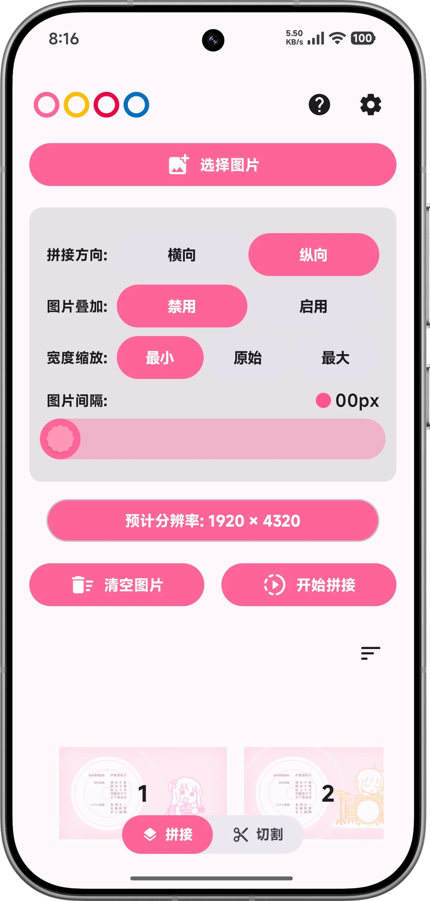
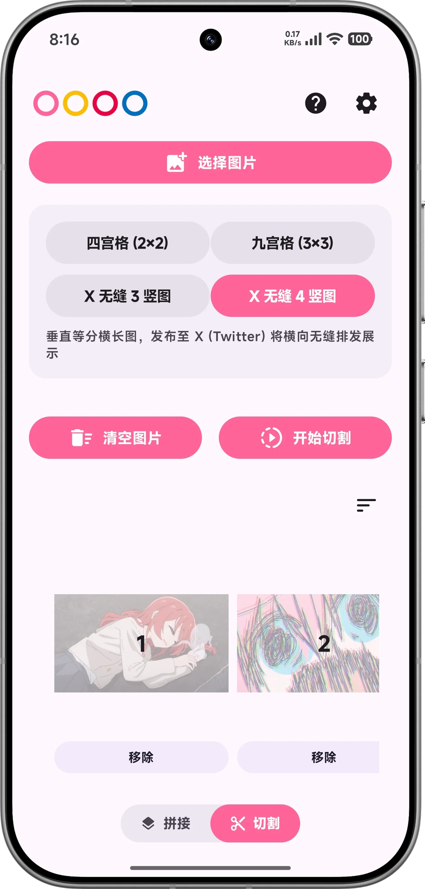
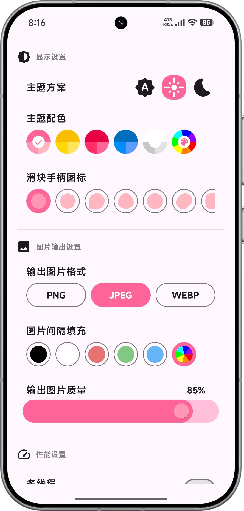
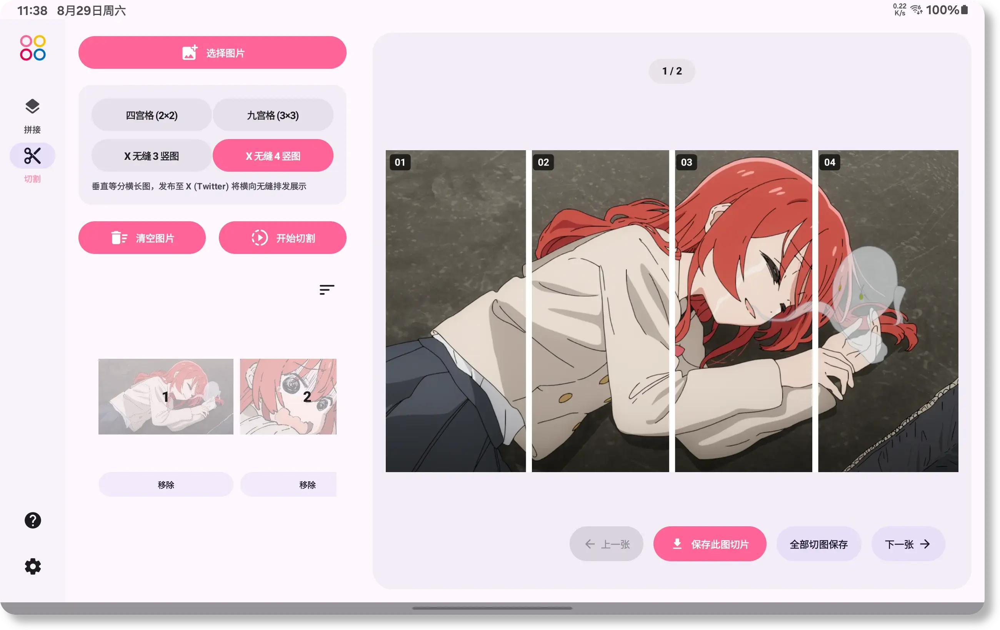
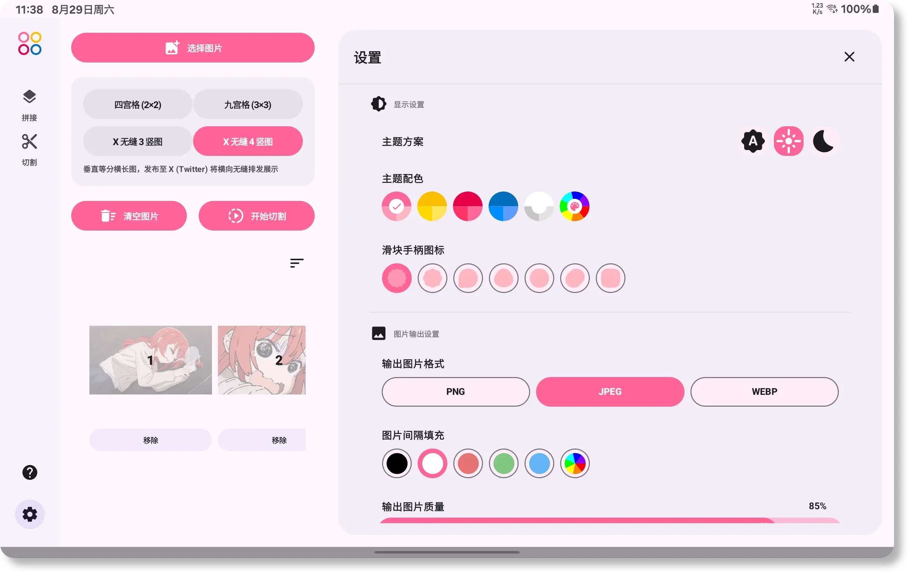
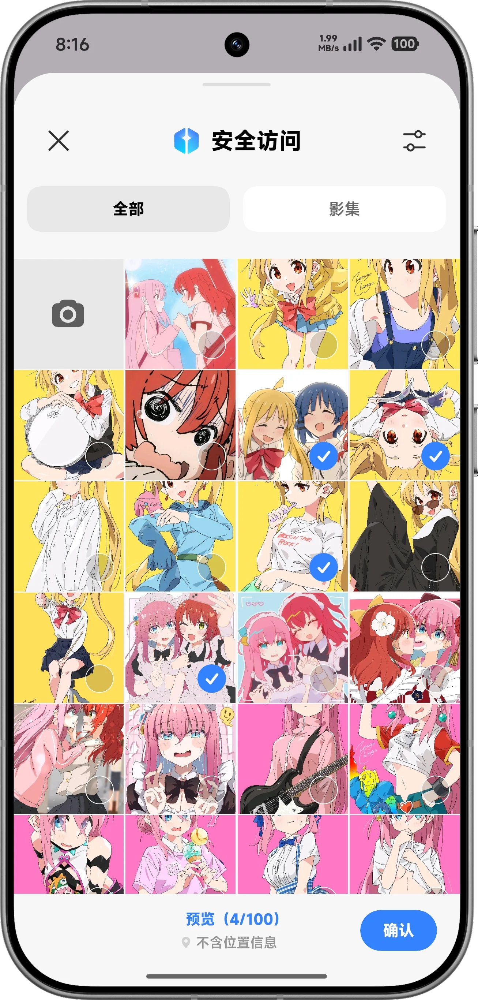
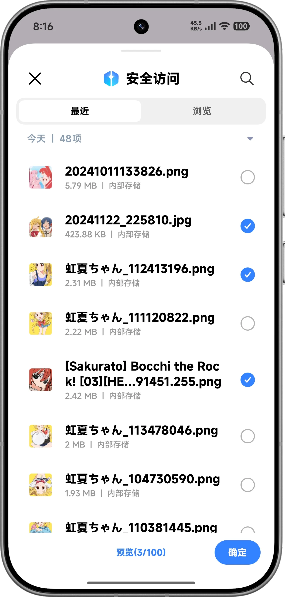
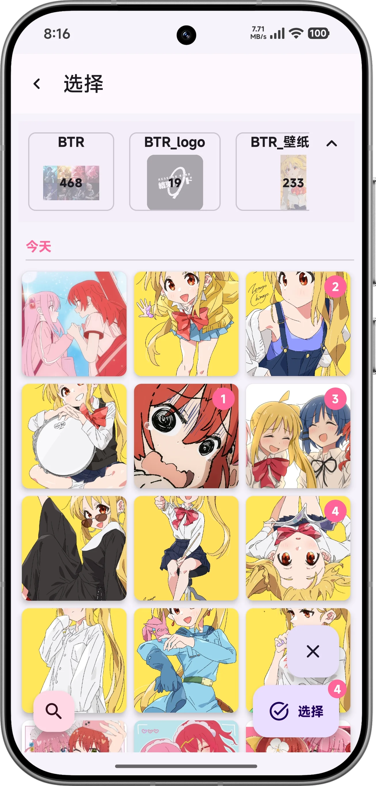

<div align="center">

</div>

<p align="center">
  
  
  <br>
  
  
  <br>
  
  
  <br>
  
  
</p>

<p align="center"><strong><a href="README.md">English</a> | 简体中文</strong></p>

## 项目概述

Chimera 是一款用于图片拼接和宫格切图的 Android 应用，使用 Kotlin 与 Jetpack Compose 开发，支持 Android 10 及以上版本。

图片解码、拼接、切图和保存均在设备上完成。应用未声明 Android `INTERNET` 权限，不会将图片传输到开发者的任何服务器。

> [!TIP]
> 如需桌面端请前往 [ChimeraWeb](https://github.com/ReRokutosei/ChimeraWeb)

## 界面预览

### 手机端

<div align="center">
  
  
  
</div>

### 平板端

<div align="center">
  
  <br>
  
  <br>
  
</div>

## 功能

### 图片访问方式

<div align="center">
  
  
  
</div>

提供 3 种选择器：

- **系统照片选择器（Photo Picker）**：在平台支持时使用，仅授予所选媒体的访问权，不需要广泛的存储权限。
- **存储访问框架（SAF）**：通过系统文档提供程序选择图片文件。
- **嵌入式选择器（Embedded Picker）**：通过源自 ImageToolbox 的组件提供相册浏览和搜索。该方式需要对应的媒体访问权限，首次使用时可能需要等待媒体索引完成。在 Android 14 及以上版本中，如果只授予部分照片访问权限，嵌入式媒体库也只会显示这些照片。

### 拼接与切图

- 直接纵向或横向拼接，可配置图片间距和填充颜色。
- 原始尺寸、最小对齐尺寸和最大对齐尺寸三种缩放模式。
- 叠加模式保留每张后续图片中指定比例的尾部区域，可用于字幕截图组合等工作流。
- 支持拖放调整已选图片顺序。
- 支持 2 x 2、3 x 3 宫格切图及 1 x 3、1 x 4 等分切图与批量保存。

### 显示与输出

- 自适应手机端和平板端布局。
- 浅色、深色和自动主题。
- 在受支持的 Android 版本上使用 Material You 动态色彩；实际颜色取决于操作系统提供的壁纸信息。
- 支持 JPEG、PNG 和 WebP 输出；质量设置仅作用于 JPEG 和 WebP。
- 可选的多线程解码与缩放；实际收益取决于图片尺寸、设备核心数和可用内存。

## 性能

下列结果比较了同一 Pixel 9 Pro AVD、Android 15、x86_64、ART `speed` 编译环境中的串行缩放和有界并行缩放。数据为固定合成数据集的中位数，仅用于同环境前后对比，不构成对实体设备性能的保证。

| 场景 | 串行 | 多线程 | 变化 |
| --- | ---: | ---: | ---: |
| 10 张中图横向直接拼接，MIN | 78.47 ms | 46.28 ms | -41.0% |
| 50 张小图纵向直接拼接，MAX | 83.53 ms | 51.45 ms | -38.4% |
| 10 张中图纵向叠加拼接，MIN | 54.99 ms | 32.47 ms | -41.0% |

当前 Baseline Profile 已在两台实体设备上完成测试，每项执行 8 次。首次启动协议的强制倒计时在测量前完成，不计入冷启动时间。

| 设备 | 场景 | 无编译 | Baseline Profile | 中位数变化 |
| --- | --- | ---: | ---: | ---: |
| Xiaomi 25113PN0EC，Android 16 | 冷启动 | 203.1 ms | 162.3 ms | -20.0% |
| Xiaomi 25113PN0EC，Android 16 | 设置页流程 | 2,079.6 ms | 2,032.3 ms | -2.3% |
| Samsung SM-T733，Android 14 | 冷启动 | 704.2 ms | 678.9 ms | -3.6% |
| Samsung SM-T733，Android 14 | 设置页流程 | 3,913.7 ms | 3,782.8 ms | -3.3% |

两台设备的冷启动均有改善，其中 Xiaomi 设备最为明显。设置页流程的区间高度重叠，因此较小的中位数差异只能说明未见明显回退，不能视为稳定加速。

完整数据集、阶段计时、编码测试、执行命令和适用限制见[图片处理性能基线](Performance_Baseline.md)。

## 技术限制

### 输出尺寸

- JPEG 输出按单边最大 65,535 像素进行校验。
- WebP 输出按单边最大 16,383 像素进行校验。
- PNG 不受上述两项编码器尺寸限制，但仍受 Android Bitmap 尺寸和设备可用内存限制。

更改输出格式不会减少解码后的源图或拼接画布所需的内存。

### 内存

Bitmap 处理通常需要约 2-4 字节/像素，此外还要同时容纳源图、缩放中间图、预览图和输出图。因此，不能只根据最终文件大小估算峰值内存。

如果处理因内存压力失败，应首先减少输入图片数量或尺寸，并关闭其他占用大量内存的应用。“提高内存阈值”仅放宽 Chimera 的内部预检限制，不会增加设备 RAM，并可能提高进程被终止或发生内存溢出的风险。

### Photo Picker 顺序

Android Photo Picker 返回的 URI 顺序可能与界面中的选择顺序不同。该行为仍记录为 [BUG](https://issuetracker.google.com/issues/264215151)。推荐使用嵌入式选择器、SAF，或手动调整图片顺序。

## 构建与验证

[](https://app.fossa.com/projects/git%2Bgithub.com%2FReRokutosei%2FChimera?ref=badge_shield)

环境要求：

- JDK 21
- Android SDK Platform 37
- 仓库内的 Gradle Wrapper

```bash
git clone --depth 1 https://github.com/ReRokutosei/Chimera.git
cd Chimera
./gradlew :app:testBenchmarkUnitTest
./gradlew :app:detekt
./gradlew lintDebug
./gradlew assembleDebug
```

未配置发布密钥库时，Release 构建会使用 debug 签名。用于正式分发时，请通过环境变量或用户级 Gradle 属性提供 `KEYSTORE_PATH`、`KEYSTORE_PASSWORD`、`KEY_ALIAS` 和 `KEY_PASSWORD`，然后运行 `./gradlew assembleRelease`。

## 隐私、担保与许可证

- [隐私政策](PrivacyPolicy_CN.md)
- [免责声明](Disclaimer_CN.md)
- [GNU 通用公共许可证第三版](../LICENSE)

<p align="center">
  <a href="https://app.fossa.com/projects/git%2Bgithub.com%2FReRokutosei%2FChimera?ref=badge_large">
    
  </a>
</p>

## 致谢

- [ImageToolbox](https://github.com/T8RIN/ImageToolbox)：从该项目抽取了三个组件：Embedded Picker、Fancy Slider 和 Image Reorder Carousel。
- 应用图标由 [Freepik](https://www.freepik.com/icon/animal_13228011) 设计。
- 项目现有的部分截图和背景素材涉及《ぼっち・ざ・ろっく！》。相关作品的权利归各自权利人所有；此处的署名不代表权利人认可或支持本项目。

## 依赖库

<details>
<summary><strong>点击查看</strong></summary>

- [AboutLibraries Core Library](https://github.com/mikepenz/AboutLibraries) 15.1.1 | Under Apache License 2.0
- [Accompanist Drawable Painter library](https://github.com/google/accompanist/) 0.32.0 | Under Apache License 2.0
- [Activity](https://developer.android.com/jetpack/androidx/releases/activity#1.13.0) 1.13.0 | Under Apache License 2.0
- [Activity Compose](https://developer.android.com/jetpack/androidx/releases/activity#1.13.0) 1.13.0 | Under Apache License 2.0
- [Activity Kotlin Extensions](https://developer.android.com/jetpack/androidx/releases/activity#1.13.0) 1.13.0 | Under Apache License 2.0
- [Android App Startup Runtime](https://developer.android.com/jetpack/androidx/releases/startup#1.1.1) 1.1.1 | Under Apache License 2.0
- [Android Arch-Common](https://developer.android.com/jetpack/androidx/releases/arch-core#2.2.0) 2.2.0 | Under Apache License 2.0
- [Android Arch-Runtime](https://developer.android.com/jetpack/androidx/releases/arch-core#2.2.0) 2.2.0 | Under Apache License 2.0
- [Android Graphics Path](https://developer.android.com/jetpack/androidx/releases/graphics#1.0.1) 1.0.1 | Under Apache License 2.0
- [Android Resource Inspection - Annotations](https://developer.android.com/jetpack/androidx/releases/resourceinspection#1.0.1) 1.0.1 | Under Apache License 2.0
- [AndroidX Autofill](https://developer.android.com/jetpack/androidx) 1.0.0 | Under Apache License 2.0
- [AndroidX Futures](https://developer.android.com/topic/libraries/architecture/index.html) 1.1.0 | Under Apache License 2.0
- [AndroidX Test Library](https://developer.android.com/testing) 1.0.1 | Under Apache License 2.0
- [AndroidX Test Library](https://developer.android.com/testing) 1.6.1 | Under Apache License 2.0
- [androidx.core:core-viewtree](https://developer.android.com/jetpack/androidx/releases/core#1.0.0) 1.0.0 | Under Apache License 2.0
- [androidx.customview:poolingcontainer](https://developer.android.com/jetpack/androidx/releases/customview#1.0.0) 1.0.0 | Under Apache License 2.0
- [Annotation](https://developer.android.com/jetpack/androidx/releases/annotation#1.10.0) 1.10.0 | Under Apache License 2.0
- [AppCompat](https://developer.android.com/jetpack/androidx/releases/appcompat#1.8.0) 1.8.0 | Under Apache License 2.0
- [AppCompat Resources](https://developer.android.com/jetpack/androidx/releases/appcompat#1.8.0) 1.8.0 | Under Apache License 2.0
- [Benchmark - Common](https://developer.android.com/jetpack/androidx/releases/benchmark#1.5.0-rc02) 1.5.0-rc02 | Under Apache License 2.0
- [Benchmark TraceProcessor](https://developer.android.com/jetpack/androidx/releases/benchmark#1.5.0-rc02) 1.5.0-rc02 | Under Apache License 2.0
- [coil](https://github.com/coil-kt/coil) 2.7.0 | Under Apache License 2.0
- [coil-base](https://github.com/coil-kt/coil) 2.7.0 | Under Apache License 2.0
- [coil-compose](https://github.com/coil-kt/coil) 2.7.0 | Under Apache License 2.0
- [coil-compose-base](https://github.com/coil-kt/coil) 2.7.0 | Under Apache License 2.0
- [collections](https://developer.android.com/jetpack/androidx/releases/collection#1.6.0) 1.6.0 | Under Apache License 2.0
- [Collections Kotlin Extensions](https://developer.android.com/jetpack/androidx/releases/collection#1.6.0) 1.6.0 | Under Apache License 2.0
- [colorpicker-compose](https://github.com/skydoves/colorpicker-compose/) 1.2.0 | Under Apache License 2.0
- [Compose Animation](https://developer.android.com/jetpack/androidx/releases/compose-animation#1.12.0) 1.12.0 | Under Apache License 2.0
- [Compose Animation](https://github.com/JetBrains/compose-multiplatform) 1.11.1 | Under Apache License 2.0
- [Compose Animation Core](https://developer.android.com/jetpack/androidx/releases/compose-animation#1.12.0) 1.12.0 | Under Apache License 2.0
- [Compose Animation Core](https://github.com/JetBrains/compose-multiplatform) 1.11.1 | Under Apache License 2.0
- [Compose Foundation](https://developer.android.com/jetpack/androidx/releases/compose-foundation#1.12.0) 1.12.0 | Under Apache License 2.0
- [Compose Foundation](https://github.com/JetBrains/compose-multiplatform) 1.11.1 | Under Apache License 2.0
- [Compose Geometry](https://developer.android.com/jetpack/androidx/releases/compose-ui#1.12.0) 1.12.0 | Under Apache License 2.0
- [Compose Geometry](https://github.com/JetBrains/compose-multiplatform) 1.11.1 | Under Apache License 2.0
- [Compose Graphics](https://developer.android.com/jetpack/androidx/releases/compose-ui#1.12.0) 1.12.0 | Under Apache License 2.0
- [Compose Graphics](https://github.com/JetBrains/compose-multiplatform) 1.11.1 | Under Apache License 2.0
- [Compose Layouts](https://developer.android.com/jetpack/androidx/releases/compose-foundation#1.12.0) 1.12.0 | Under Apache License 2.0
- [Compose Layouts](https://github.com/JetBrains/compose-multiplatform) 1.11.1 | Under Apache License 2.0
- [Compose Material Icons Core](https://developer.android.com/jetpack/androidx/releases/compose-material#1.7.8) 1.7.8 | Under Apache License 2.0
- [Compose Material Icons Extended](https://developer.android.com/jetpack/androidx/releases/compose-material#1.7.8) 1.7.8 | Under Apache License 2.0
- [Compose Material Ripple](https://developer.android.com/jetpack/androidx/releases/compose-material#1.12.0) 1.12.0 | Under Apache License 2.0
- [Compose Material3 Components](https://developer.android.com/jetpack/androidx/releases/compose-material3#1.5.0-alpha27) 1.5.0-alpha27 | Under Apache License 2.0
- [Compose Material3 Ripple](https://developer.android.com/jetpack/androidx/releases/compose-material3#1.5.0-alpha27) 1.5.0-alpha27 | Under Apache License 2.0
- [Compose Navigation](https://developer.android.com/jetpack/androidx/releases/navigation#2.10.0) 2.10.0 | Under Apache License 2.0
- [Compose Runtime](https://developer.android.com/jetpack/androidx/releases/compose-runtime#1.12.0) 1.12.0 | Under Apache License 2.0
- [Compose Runtime](https://github.com/JetBrains/compose-multiplatform) 1.11.1 | Under Apache License 2.0
- [Compose Runtime Annotation](https://developer.android.com/jetpack/androidx/releases/compose-runtime#1.12.0) 1.12.0 | Under Apache License 2.0
- [Compose Runtime Retain](https://developer.android.com/jetpack/androidx/releases/compose-runtime#1.12.0) 1.12.0 | Under Apache License 2.0
- [Compose Saveable](https://developer.android.com/jetpack/androidx/releases/compose-runtime#1.12.0) 1.12.0 | Under Apache License 2.0
- [Compose Saveable](https://github.com/JetBrains/compose-multiplatform) 1.11.1 | Under Apache License 2.0
- [Compose Testing manifest dependency](https://developer.android.com/jetpack/androidx/releases/compose-ui#1.12.0) 1.12.0 | Under Apache License 2.0
- [Compose Tooling](https://developer.android.com/jetpack/androidx/releases/compose-ui#1.12.0) 1.12.0 | Under Apache License 2.0
- [Compose Tooling Data](https://developer.android.com/jetpack/androidx/releases/compose-ui#1.12.0) 1.12.0 | Under Apache License 2.0
- [Compose UI](https://developer.android.com/jetpack/androidx/releases/compose-ui#1.12.0) 1.12.0 | Under Apache License 2.0
- [Compose UI](https://github.com/JetBrains/compose-multiplatform) 1.11.1 | Under Apache License 2.0
- [Compose UI Preview Tooling](https://developer.android.com/jetpack/androidx/releases/compose-ui#1.12.0) 1.12.0 | Under Apache License 2.0
- [Compose UI Text](https://developer.android.com/jetpack/androidx/releases/compose-ui#1.12.0) 1.12.0 | Under Apache License 2.0
- [Compose UI Text](https://github.com/JetBrains/compose-multiplatform) 1.11.1 | Under Apache License 2.0
- [Compose Unit](https://developer.android.com/jetpack/androidx/releases/compose-ui#1.12.0) 1.12.0 | Under Apache License 2.0
- [Compose Unit](https://github.com/JetBrains/compose-multiplatform) 1.11.1 | Under Apache License 2.0
- [Compose Util](https://developer.android.com/jetpack/androidx/releases/compose-ui#1.12.0) 1.12.0 | Under Apache License 2.0
- [Compose Util](https://github.com/JetBrains/compose-multiplatform) 1.11.1 | Under Apache License 2.0
- [ConstraintLayout](https://developer.android.com/jetpack/androidx/releases/constraintlayout#2.2.1) 2.2.1 | Under Apache License 2.0
- [ConstraintLayout Core](https://developer.android.com/jetpack/androidx/releases/constraintlayout#1.1.1) 1.1.1 | Under Apache License 2.0
- [Core](https://developer.android.com/jetpack/androidx/releases/core#1.19.0) 1.19.0 | Under Apache License 2.0
- [Core Kotlin Extensions](https://developer.android.com/jetpack/androidx/releases/core#1.19.0) 1.19.0 | Under Apache License 2.0
- [Custom View](https://developer.android.com/jetpack/androidx/releases/customview#1.2.0) 1.2.0 | Under Apache License 2.0
- [DataStore](https://developer.android.com/jetpack/androidx/releases/datastore#1.2.1) 1.2.1 | Under Apache License 2.0
- [DataStore Core](https://developer.android.com/jetpack/androidx/releases/datastore#1.2.1) 1.2.1 | Under Apache License 2.0
- [DataStore Core Okio](https://developer.android.com/jetpack/androidx/releases/datastore#1.2.1) 1.2.1 | Under Apache License 2.0
- [DynamicAnimation](https://developer.android.com/jetpack/androidx/releases/dynamicanimation#1.1.0) 1.1.0 | Under Apache License 2.0
- [Emoji2](https://developer.android.com/jetpack/androidx/releases/emoji2#1.4.0) 1.4.0 | Under Apache License 2.0
- [Emoji2 Views Helper](https://developer.android.com/jetpack/androidx/releases/emoji2#1.4.0) 1.4.0 | Under Apache License 2.0
- [error-prone annotations](https://errorprone.info/error_prone_annotations) 2.15.0 | Under Apache License 2.0
- [ExifInterface](https://developer.android.com/jetpack/androidx/releases/exifinterface#1.4.2) 1.4.2 | Under Apache License 2.0
- [Experimental annotation](https://developer.android.com/jetpack/androidx/releases/annotation#1.4.1) 1.4.1 | Under Apache License 2.0
- [Graphics Shapes](https://developer.android.com/jetpack/androidx/releases/graphics#1.0.1) 1.0.1 | Under Apache License 2.0
- [Guava ListenableFuture only](https://github.com/google/guava/listenablefuture) 1.0 | Under Apache License 2.0
- [JetBrains Java Annotations](https://github.com/JetBrains/java-annotations) 23.0.0 | Under Apache License 2.0
- [Jetpack Compose Libraries BOM](https://developer.android.com/jetpack) 2026.08.00 | Under Apache License 2.0
- [JSpecify annotations](http://jspecify.org/) 1.0.0 | Under Apache License 2.0
- [Kotlin Libraries bill-of-materials](https://kotlinlang.org/) 1.8.22 | Under Apache License 2.0
- [Kotlin Stdlib](https://kotlinlang.org/) 2.4.10 | Under Apache License 2.0
- [Kotlin Stdlib Common](https://kotlinlang.org/) 2.4.10 | Under Apache License 2.0
- [Kotlin Stdlib Jdk7](https://kotlinlang.org/) 1.9.0 | Under Apache License 2.0
- [Kotlin Stdlib Jdk8](https://kotlinlang.org/) 1.9.0 | Under Apache License 2.0
- [kotlinx-coroutines-android](https://github.com/Kotlin/kotlinx.coroutines) 1.11.0 | Under Apache License 2.0
- [kotlinx-coroutines-bom](https://github.com/Kotlin/kotlinx.coroutines) 1.11.0 | Under Apache License 2.0
- [kotlinx-coroutines-core](https://github.com/Kotlin/kotlinx.coroutines) 1.11.0 | Under Apache License 2.0
- [kotlinx-serialization-bom](https://github.com/Kotlin/kotlinx.serialization) 1.11.0 | Under Apache License 2.0
- [kotlinx-serialization-core](https://github.com/Kotlin/kotlinx.serialization) 1.11.0 | Under Apache License 2.0
- [kotlinx-serialization-json](https://github.com/Kotlin/kotlinx.serialization) 1.11.0 | Under Apache License 2.0
- [Lifecycle Kotlin Extensions](https://developer.android.com/jetpack/androidx/releases/lifecycle#2.11.0) 2.11.0 | Under Apache License 2.0
- [Lifecycle LiveData](https://developer.android.com/jetpack/androidx/releases/lifecycle#2.11.0) 2.11.0 | Under Apache License 2.0
- [Lifecycle LiveData Core](https://developer.android.com/jetpack/androidx/releases/lifecycle#2.11.0) 2.11.0 | Under Apache License 2.0
- [Lifecycle Process](https://developer.android.com/jetpack/androidx/releases/lifecycle#2.11.0) 2.11.0 | Under Apache License 2.0
- [Lifecycle Runtime](https://developer.android.com/jetpack/androidx/releases/lifecycle#2.11.0) 2.11.0 | Under Apache License 2.0
- [Lifecycle Runtime](https://github.com/JetBrains/compose-jb) 2.9.6 | Under Apache License 2.0
- [Lifecycle Runtime Compose](https://developer.android.com/jetpack/androidx/releases/lifecycle#2.11.0) 2.11.0 | Under Apache License 2.0
- [Lifecycle Runtime Compose](https://github.com/JetBrains/compose-jb) 2.9.6 | Under Apache License 2.0
- [Lifecycle ViewModel](https://developer.android.com/jetpack/androidx/releases/lifecycle#2.11.0) 2.11.0 | Under Apache License 2.0
- [Lifecycle ViewModel](https://github.com/JetBrains/compose-jb) 2.9.6 | Under Apache License 2.0
- [Lifecycle ViewModel Compose](https://developer.android.com/jetpack/androidx/releases/lifecycle#2.11.0) 2.11.0 | Under Apache License 2.0
- [Lifecycle ViewModel Kotlin Extensions](https://developer.android.com/jetpack/androidx/releases/lifecycle#2.11.0) 2.11.0 | Under Apache License 2.0
- [Lifecycle ViewModel with SavedState](https://developer.android.com/jetpack/androidx/releases/lifecycle#2.11.0) 2.11.0 | Under Apache License 2.0
- [Lifecycle ViewModel with SavedState](https://github.com/JetBrains/compose-jb) 2.9.6 | Under Apache License 2.0
- [Lifecycle-Common](https://developer.android.com/jetpack/androidx/releases/lifecycle#2.11.0) 2.11.0 | Under Apache License 2.0
- [Lifecycle-Common](https://github.com/JetBrains/compose-jb) 2.9.6 | Under Apache License 2.0
- [Lifecycle-Common for Java 8](https://developer.android.com/jetpack/androidx/releases/lifecycle#2.11.0) 2.11.0 | Under Apache License 2.0
- [LiveData Core Kotlin Extensions](https://developer.android.com/jetpack/androidx/releases/lifecycle#2.11.0) 2.11.0 | Under Apache License 2.0
- [Material Components for Android](https://github.com/material-components/material-components-android) 1.14.0 | Under Apache License 2.0
- [Moshi](https://github.com/square/moshi/) 1.13.0 | Under Apache License 2.0
- [Navigation Common](https://developer.android.com/jetpack/androidx/releases/navigation#2.10.0) 2.10.0 | Under Apache License 2.0
- [Navigation Event](https://developer.android.com/jetpack/androidx/releases/navigationevent#1.1.2) 1.1.2 | Under Apache License 2.0
- [Navigation Runtime](https://developer.android.com/jetpack/androidx/releases/navigation#2.10.0) 2.10.0 | Under Apache License 2.0
- [NavigationEvent Compose](https://developer.android.com/jetpack/androidx/releases/navigationevent#1.1.2) 1.1.2 | Under Apache License 2.0
- [okhttp](https://square.github.io/okhttp/) 4.12.0 | Under Apache License 2.0
- [okio](https://github.com/square/okio/) 3.9.1 | Under Apache License 2.0
- [Parcelize Runtime](https://kotlinlang.org/) 2.4.10 | Under Apache License 2.0
- [Preferences DataStore](https://developer.android.com/jetpack/androidx/releases/datastore#1.2.1) 1.2.1 | Under Apache License 2.0
- [Preferences DataStore Core](https://developer.android.com/jetpack/androidx/releases/datastore#1.2.1) 1.2.1 | Under Apache License 2.0
- [Preferences DataStore Proto](https://developer.android.com/jetpack/androidx/releases/datastore#1.2.1) 1.2.1 | Under Apache License 2.0
- [Preferences External Protobuf](https://developer.android.com/jetpack/androidx/releases/datastore#1.2.1) 1.2.1 | Under BSD 3-Clause "New" or "Revised" License
- [Profile Installer](https://developer.android.com/jetpack/androidx/releases/profileinstaller#1.4.1) 1.4.1 | Under Apache License 2.0
- [RecyclerView](https://developer.android.com/jetpack/androidx/releases/recyclerview#1.4.0) 1.4.0 | Under Apache License 2.0
- [Reorderable](https://github.com/Calvin-LL/Reorderable) 3.1.0 | Under Apache License 2.0
- [Saved State](https://developer.android.com/jetpack/androidx/releases/savedstate#1.5.0) 1.5.0 | Under Apache License 2.0
- [Saved State](https://github.com/JetBrains/compose-jb) 1.3.6 | Under Apache License 2.0
- [Saved State Compose](https://developer.android.com/jetpack/androidx/releases/savedstate#1.5.0) 1.5.0 | Under Apache License 2.0
- [Saved State Compose](https://github.com/JetBrains/compose-jb) 1.3.6 | Under Apache License 2.0
- [SavedState Kotlin Extensions](https://developer.android.com/jetpack/androidx/releases/savedstate#1.5.0) 1.5.0 | Under Apache License 2.0
- [SubsamplingScaleImageView](https://github.com/davemorrissey/subsampling-scale-image-view) 3.10.0 | Under Apache License 2.0
- [Support AnimatedVectorDrawable](https://developer.android.com/jetpack/androidx) 1.1.0 | Under Apache License 2.0
- [Support CardView v7](http://developer.android.com/tools/extras/support-library.html) 1.0.0 | Under Apache License 2.0
- [Support Coordinator Layout](https://developer.android.com/jetpack/androidx) 1.1.0 | Under Apache License 2.0
- [Support Cursor Adapter](http://developer.android.com/tools/extras/support-library.html) 1.0.0 | Under Apache License 2.0
- [Support Drawer Layout](https://developer.android.com/jetpack/androidx) 1.1.1 | Under Apache License 2.0
- [Support fragment](https://developer.android.com/jetpack/androidx/releases/fragment#1.5.4) 1.5.4 | Under Apache License 2.0
- [Support Interpolators](http://developer.android.com/tools/extras/support-library.html) 1.0.0 | Under Apache License 2.0
- [Support loader](http://developer.android.com/tools/extras/support-library.html) 1.0.0 | Under Apache License 2.0
- [Support VectorDrawable](https://developer.android.com/jetpack/androidx) 1.1.0 | Under Apache License 2.0
- [Support View Pager](http://developer.android.com/tools/extras/support-library.html) 1.0.0 | Under Apache License 2.0
- [Tracing](https://developer.android.com/jetpack/androidx/releases/tracing#2.0.1) 2.0.1 | Under Apache License 2.0
- [Tracing Kotlin Extensions](https://developer.android.com/jetpack/androidx/releases/tracing#2.0.1) 2.0.1 | Under Apache License 2.0
- [Tracing Perfetto Handshake](https://developer.android.com/jetpack/androidx/releases/tracing#1.0.0) 1.0.0 | Under Apache License 2.0
- [Transition](https://developer.android.com/jetpack/androidx/releases/transition#1.5.0) 1.5.0 | Under Apache License 2.0
- [VersionedParcelable](http://developer.android.com/tools/extras/support-library.html) 1.1.1 | Under Apache License 2.0
- [ViewPager2](https://developer.android.com/jetpack/androidx/releases/viewpager2#1.1.0-beta02) 1.1.0-beta02 | Under Apache License 2.0
- [WindowManager](https://developer.android.com/jetpack/androidx/releases/window#1.5.0) 1.5.0 | Under Apache License 2.0
- [WindowManager Core](https://developer.android.com/jetpack/androidx/releases/window#1.5.0) 1.5.0 | Under Apache License 2.0
- [wire-runtime](https://github.com/square/wire/) 6.4.0 | Under Apache License 2.0

</details>
